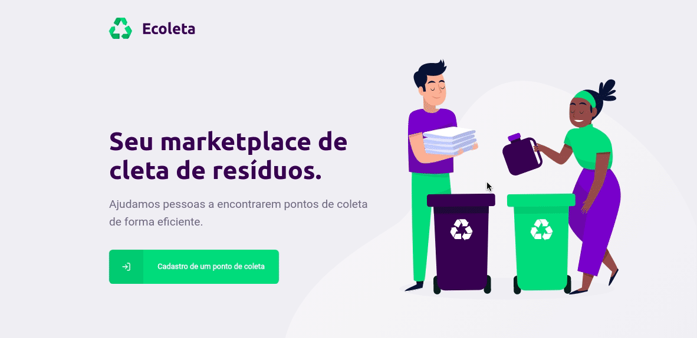

<p align='center'>
  
</p>

<h1 align="center">
  Next Level Week#01 - Ecoleta
</h1>

<blockquote align="center">“Avance para o próximo level”!</blockquote>

<p>
  
</p>

## :rocket: Sobre o NLW

Este é um evento totalmente gratuito e online, criado pela empresa [Rocketseat](https://github.com/Rocketseat), onde ficará disponível do dia 01/06 até 23:59pm do dia 07/06, esta edição.

E o objetivo deste evento é você alcançar o próximo level como programador(a), com as tecnologias mas modernas do mercado: **Node.js** para o backend e o **React** para o frontend, tanto na parte web (ReactJs), como também para o mobile (React Native).

Já pensou em quanto de conhecimento você pode adquirir neste evento?

> Simplismente infinito !! 🚀

Ou seja, você vai estar ápto para concorrer aquela vaga que você tanto sonhou.

___

## ⛏ Projeto

A Rocketseat cuidou muito bem do desenvolvimento deste projeto, chamado de **Ecoleta**.

Onde passamos por diversos conceitos das tecnologias:

- [Node.js](https://nodejs.org/en/) - Backend
- [ReactJs](https://pt-br.reactjs.org/) - Frontend
- [React Native](https://reactnative.dev/) - Mobile

## 🔥 Starting

### :zap: Server

Para conseguir startar a aplicação, você precisa, instalar as dependências de cada projeto (server, web, mobile), em cada pasta executar:

```bash
$ yarn
```

Depois que instalar as dependências, você executará os comandos para criar as migrations e os seeds, na pasta `server`, onde todos os scripts, você encontrará no arquivo `package.json`, para facilitar, faça o seguinte:

```bash
$ yarn knex:migrate
```

```bash
$ yarn knex:seed
```

Agora para iniciar o backend, você irá executar:

```bash
$ yarn dev
```
### 🖥 Frontend

Agora para startar o frontend, você entrará na pasta e executará:

```bash
$ yarn start
```

Com isso você já vai estar executando o frontend da aplicação.

### 📱 Mobile

Para executar o projeto mobile, você precisará estar com o aplicativo `expo-client` no seu dispositivo. Com ele, basta entrar na pasta mobile e executar:

```bash
$ yarn start
```

Logo depois, você irá scanear o qr-code e neste momento, o expo cuidará do bundle da aplicação sozinho. Deixando você ápto para avançar no projeto.

##  📝 Mensagem Final

Se eu pudesse no fim deste README, te deixar uma mensagem, seria essa:

> Não fique estagnado, busque sempre mais!

Então vem com a gente embarcar neste foguete? [Acesse o link](https://nextlevelweek.com/inscricao/1) e se inscreva, ainda tem tempo *jovem dev*!

Feito com 💜 by Daniel Felizardo