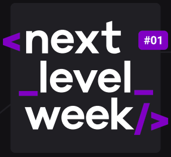

  

<h3 align="center">
  Next Level Week
</h3>

<blockquote align="center">“Avance para o próximo level”!</blockquote>

## :rocket: Sobre o NLW

Este é um evento totalmente gratuito e online, criado pela empresa [Rocketseat](https://github.com/Rocketseat), onde ficará disponível do dia 01/06 até 23:59pm do dia 07/06, esta edição.

E o objetivo deste evento é você alcançar o próximo level como programador(a), com as tecnologias mas modernas no mercado: **Node.js** para o backend e o **React** para o frontend, tanto na parte web (ReactJs), como também para o mobile (React Native).

Já pensou em quanto de conhecimento você pode adquirir neste evento?

> Simplismente infinito !! :rocket: 💜

Ou seja, você vai estar ápto para concorrer aquela vaga que você tanto tem colocado o seu foco.

___

Se eu pudesse no fim deste README, te deixar uma mensagem, seria essa:

<blockquote>Não fique estagnado, busque sempre mais!</blockquote>

Então vem com a gente embarcar neste foguete? [Acesse o link](https://nextlevelweek.com/inscricao/1) e se inscreva, ainda tem tempo *jovem dev*!

Feito com 💜 by Daniel Felizardo